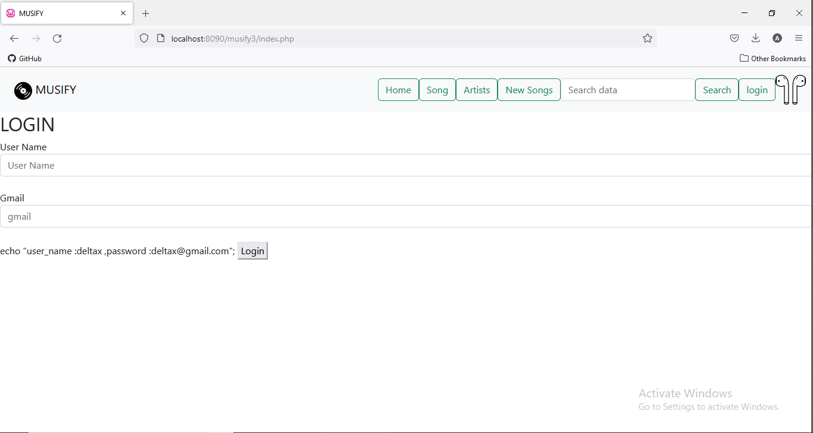
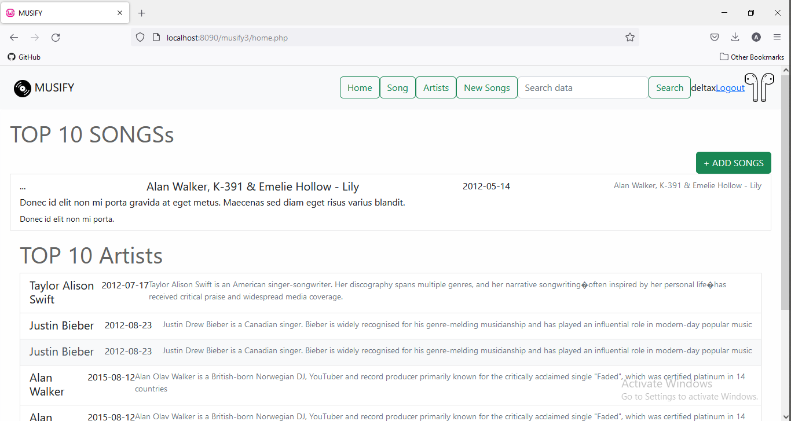
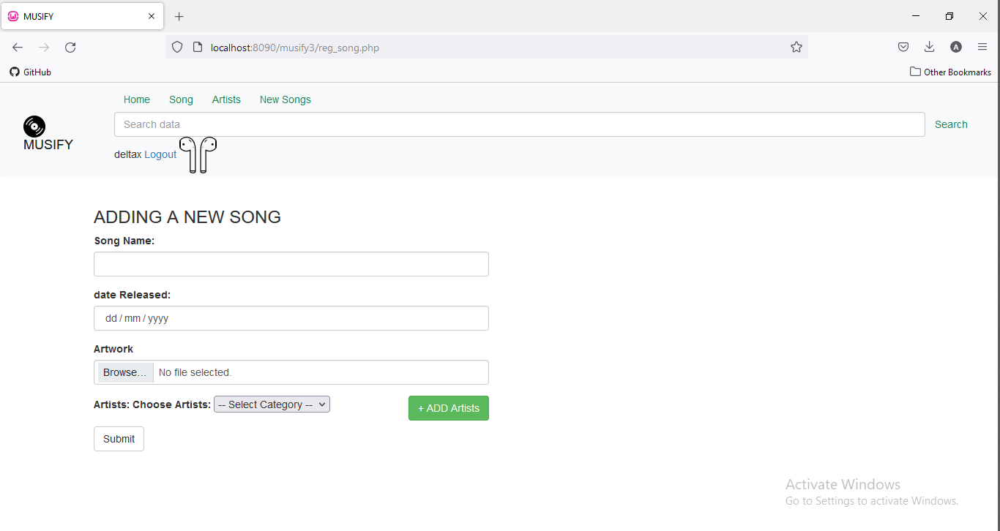

# Musify
A project,  assignment for Delta-x
 
 <h1>hello</h1>
 <h4>i consider this as a project, a online music website 
 the website usied to add songs and artists detials and when we search a song  we get the song and who the artist is same way when we 
 search the artist it will display the songs and artists who sang songs </h4>
 
 
 <h2>Langauges Used</h2>
 <h4>HTML</h4>
 <h4>PHP</h4>
 <h4>SQL</h4>
 
 <h1> introducing the structure of the website</h1>

 <h3>Login Section</h3>
 
 
 

  

<h3>Home Page</h3>
 
 
 

  

<h3>Song Add Window</h3>
 
 
 

  

